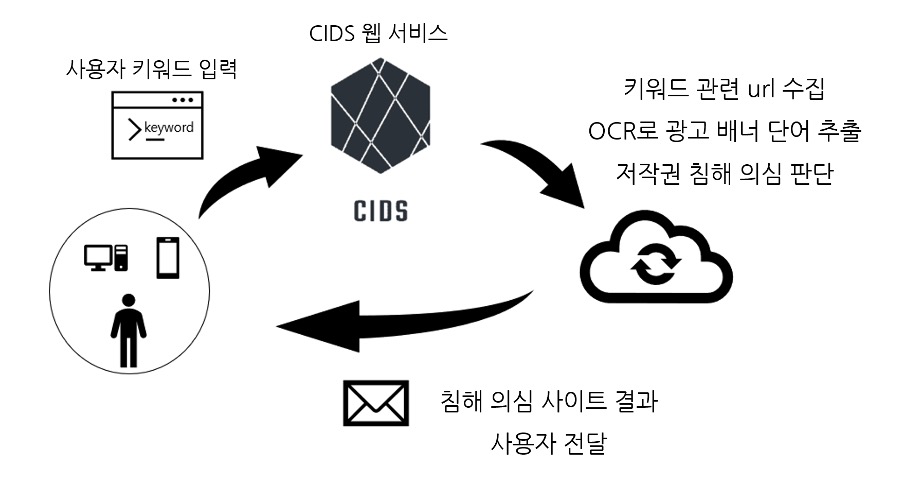

# CIDS 백엔드 - Spring Boot

Problem : 

Idea :

Solution : 

- [FrontEnd](https://github.com/jungwoo-0530/CIDS_Front)
- [머신 러닝(Flask)](https://github.com/jungwoo-0530/CIDS_LM)

# 목차

- [주요 기능과 로직](#주요-기능)

- [서비스 구조](#서비스-구조)
- [기술 스택](#기술-스택)
- [기획 & 설계](#기획-&-설계)
  - [기능 명세서](#기능-명세서)
  - [페이지 기획서](#페이지-기획서)
  - [API 명세서](#API-명세서(Spring-Boot))
  - [DB 명세서](#DB-명세서)

## 주요 기능과 로직

- 저작권 침해 사이트 검색 서비스(CIDS 서비스) : 웹툰 저작권 침해 의심되는 키워드를 입력하면 저작권 침해 의심되는 사이트를 이메일로 보내줌
- 게시판 기능 : 공지사항, QnA 게시판에서 운영자, 사용자가 글을 올리고 이미지도 올릴 수 있음
- 댓글 기능 : 중첩 세트 모델(The Nested Set Model)을 사용하여 대댓글 기능을 구현
- 페이징 기능 : 게시물, 대쉬 보드, 의심 도메인, 회원들 카테고리를 백에서 프론트로 알맞는 개수씩 보내줌
- 로그인 : 로그인시 JWT토큰을 발급하여 백엔드에서 사용자 인증
- 마이 페이지 : 마이페이지에서 개인 정보 변경과 이미지를 설정할 수 있음
- 크롤링 : 파이썬을 사용하여 유저가 CIDS 서비스에서 키워드를 입력시 그에 맞는 정보를 크롤링
- Multiple Database : 메인 DB(MariaDB)와 머신러닝 DB(MongoDB)인 두 개의 DB를 사용함
- 배포 : AWS 

## 서비스 구조

<대략적인 서비스 플로우>
  

CIDS Web App Architecture

이메일 결과
  

## 기술 스택

- Front
  - Javascript, React
- Back
  - Java - version 8, SpringBoot, Spring Data JPA, Gradle
  - Python - version 3.10,  Flask, Google Vision Api
  - MariaDB, MongoDB
  - AWS(EC2, RDS, S3,  Document DB) 

## 기획 & 설계

- [기능 명세서](#기능-명세서)
- [페이지 기획서](#페이지-기획서)
- [API 명세서](#API-명세서(Spring-Boot))

- [DB 명세서](#DB-명세서)

### 기능 명세서

### 페이지 기획서

### 

### API 명세서(Spring Boot)

- Swagger 사용

### DB 명세서
