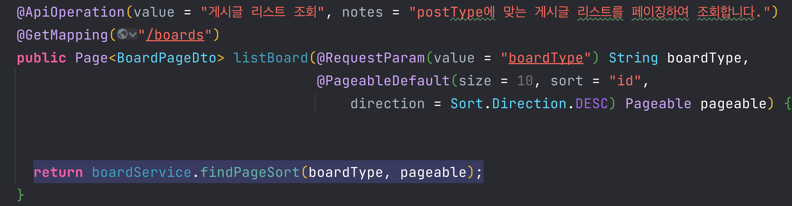

# 기능 명세서

### 목차

1. [CIDS 서비스](#침해-의심-사이트-탐지)
   1. 

2. [유저](#유저)
3. [게시판](#게시판)
   1. [게시글 조회](#게시글-조회)
   2. [게시글 단건 조회](#게시글-단건-조회)
   3. [게시글 쓰기](#게시글-쓰기)
   4. [게시글 수정](#게시글-수정)
   5. [게시글 삭제](#게시글-삭제)
   6. [게시글 검색](#게시글-검색)

4. [댓글](#댓글)
   1. [댓글 리스트 조회](#댓글-리스트-조회)
   2. [댓글,대댓글 쓰기](#댓글,-대댓글-쓰기)
   3. [댓글, 대댓글 수정](#댓글,-대댓글-수정)
   4. [댓글, 대댓글 삭제](#댓글,-대댓글-삭제)

5. [Spring Security](#Spring-Security)
6. [Multiple Database](Multiple-Database)
7. [예외 처리](#예외-처리)

## 침해 의심 사이트 탐지

## 유저

### 1. 로그인

- 로직

  - 사용자는 클라이언트에서 ID와 Password를 입력하면 **클라이언트에서 바디에 실어서 서버로 POST 메서드**로 요청한다.
  - 서버는 요청을 받고 **DB에 있는 Password를 decode해서 비교**한다.
  - 비교시 일치한다면 서버(Spring Boot)에서 **Secret 키를 이용해 encode해서 JWT 토큰을 발급하고 응답**한다. 
  - 브라우저에서 **JWT 토큰을 저장**한다.

  - 클라이언트에서 **HTTP 요청시 JWT토큰 String을 헤더에 실어서 요청**한다.

  - 서버는 헤더의 `Authorization` 항목을 읽어서 JWT 토큰을 **Secret키로 decode하여 Verify**를 진행한다.
  - 즉, 간단하게 로그인하면 유저에게 Access Token(JWT)를 발급합니다.

### 2. 

## 게시판

### 1. 게시글 조회

게시글 조회는 이 프로젝트에서 공지사항(notification) 게시판과 QnA(qna) 게시판이 존재합니다.

클라이언트에서 qna게시판을 들어오면 `/boards?boardType=qna&page=0` url로 요청이 옵니다.

- `QueryDsl`을 사용하여 게시물 타입(boardType)에 따라서 동적으로 페이징 처리를 합니다.
- Select 절에서 조회할 변수들은 QClass를 프로젝션하면 원치않는 필드까지 조회되므로 불필요한 조회를 방지하기 위해서 Field 직접 접근을 사용합니다.
- `Pageable`에 내가 컨트롤러에서 설정한 속성들이 있으므로 그 속성을 이용하여 offset, limit을 설정합니다.

### 2. 게시글 단건 조회

### 3. 게시글 쓰기

### 4. 게시글 수정

### 5. 게시글 삭제

### 6. 게시물 검색

## 댓글

### 1. 댓글 리스트 조회

### 2. 댓글, 대댓글 쓰기

### 3. 댓글, 대댓글 수정

### 4. 댓글, 대댓글 삭제

## Spring Security

## Multiple Database

## 예외 처리

